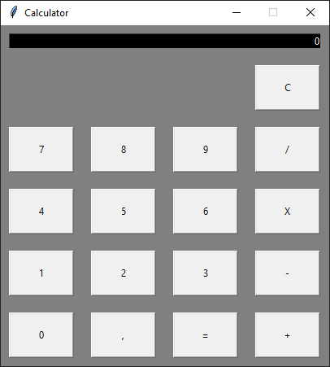

<header>
    <h1>Basic Calculator 📝</h1>
</header>

    
This is the <strong>first "serious" project</strong> I have done. It basically is a simple calculator made with <code>Tkinter</code> that can perform sum, substraction, multiplication and division. <strong>It doesn't allow parenthesis</strong>, so in order to get multiple operations right, you first have to hit the "Equals" (=) button before trying to perform any other operation.

    

<section>

    <h2>How it works 🔧</h2>

    
In this section I will show you how this simple calculator program works:

    <ol>
        <li>Use <code>git clone</code> to clone the repository and execute the <code>Calculator.py</code> file (or just download this sigle file, it's the only one needed). After that, you will have something like this:   
        
          
        </li>
        <li>Introduce a number and after that, press any operation symbol. Pressing an operations symbol should store the number in the <code>result</code> variable and reset the screen value to 0.
          
        </li>
        <li>Now you have 2 options:  
            <ul>
                <li>Introduce a new value and press "Equals" (=) button. This should give the desired result
                  
                </li>
                <li>Introduce a new value and press the same operational symbol as before to concatenate (e.g. the sum) as many times as you want, and then press the "Equals" (=) button. Before switching between operations, <strong>always</strong> hit the "Equals" (=) button  </li>
            </ul>
        </li>
        <li>And that's all, you should be able to work perfectly with this calculator to perform easy math 😉.  </li>
    </ol>

</section>

<section>
    <h2>
        Contact me:
    </h2>
    
In case you have any doubt or you are interested about my work, you can contact me here: 

    <ul>
        <li>Mi linkedin: </li>
        <li>Mi correo: <a href="mailto:pedro.tobarra.leal@gmail.com">Pedro.tobarra.leal@gmail.com</a></li>
    </ul>
</section>